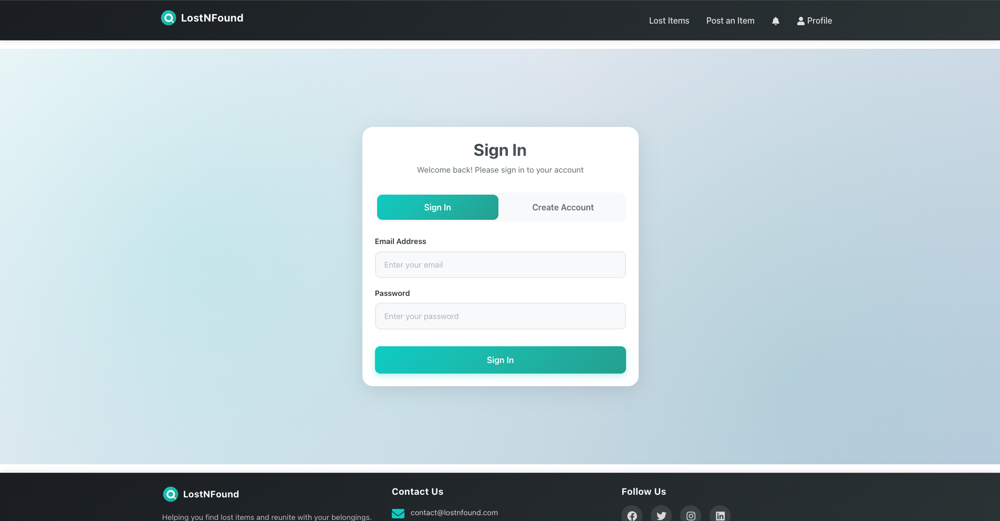
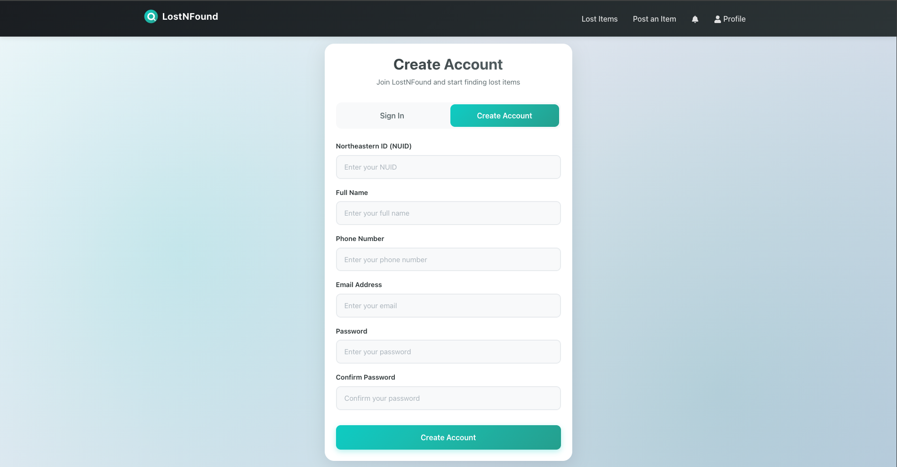
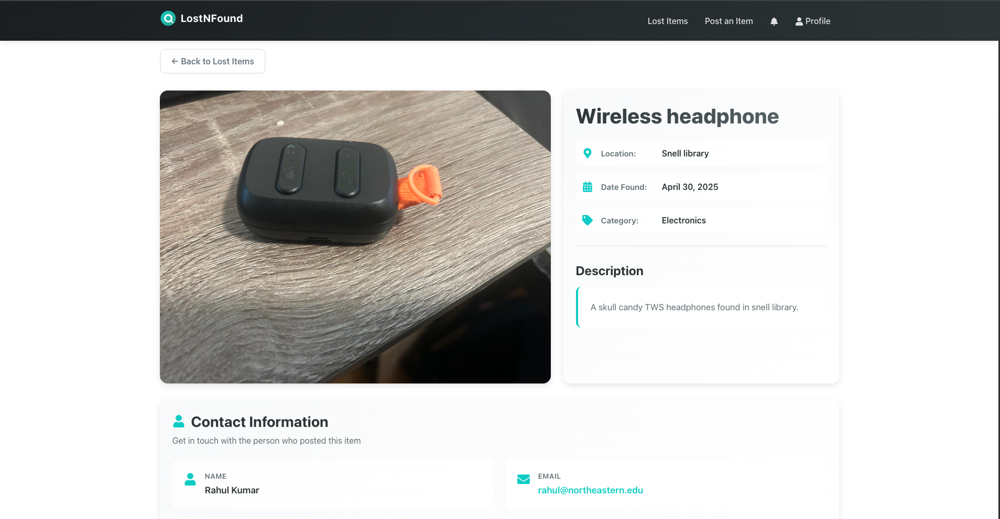
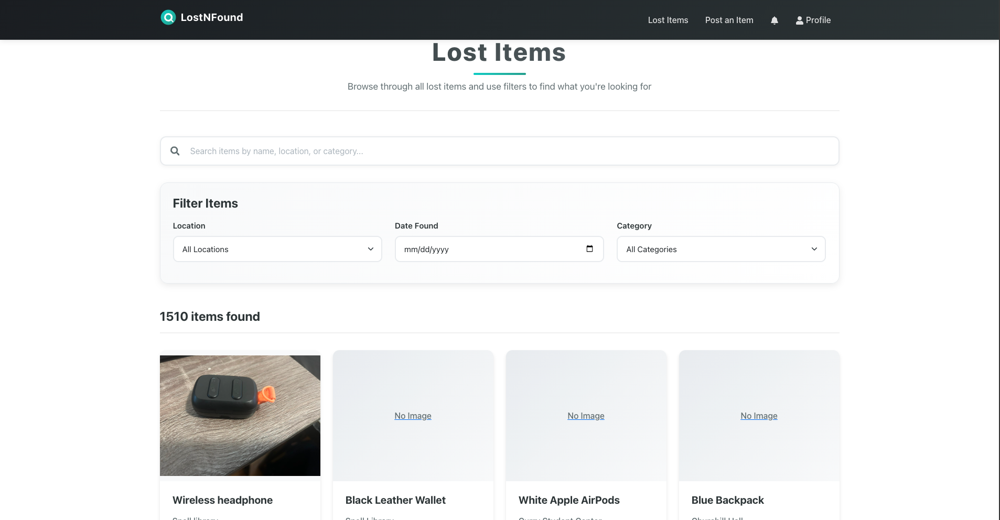
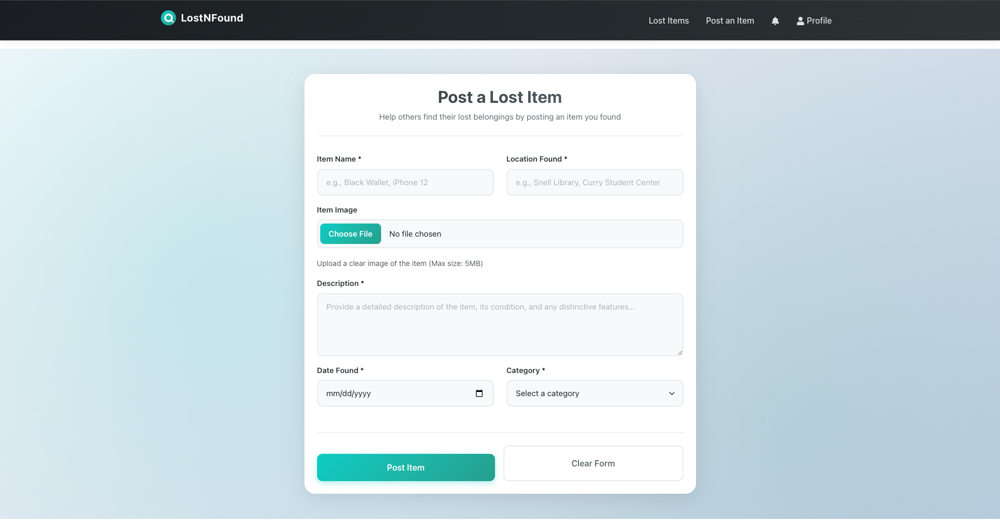
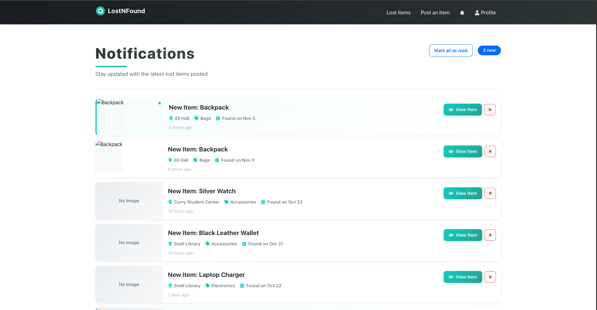
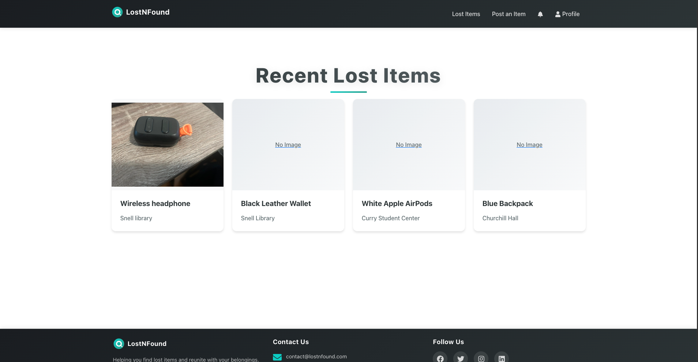

# LostNFound

LostNFound is a full-stack web application that helps the Northeastern community report, surface, and reunite lost items with their owners. Students can post newly found objects, search existing listings, and manage their own submissions from a streamlined profile dashboard.

## Authors

- Sourav Das
- Puneet Singh Puri

## Class Information

- **Course:** CS5610 – Web Development
- **Class Link:** https://johnguerra.co/classes/webDevelopment_online_fall_2025/

## Project Objective

Deliver a dependable campus Lost & Found workflow that:

- Captures detailed reports (category, description, images, location, time found).
- Gives students a personalized view of their submissions and status changes.
- Accelerates matches between lost and found reports through search, filtering, and secure communication.

## Feature Highlights

- **Post Lost & Found items:** Upload descriptions, categories, locations, and supporting images.
- **Authentication & Profiles:** JWT-based login keeps each user’s items secure and editable.
- **Post management:** Toggle status (searching/claimed), delete posts, and review history from the profile screen.
- **Password controls:** Built-in password change flow that validates the current credential.

## Screenshots

| Home Feed                         | Profile & Posts |
| --------------------------------- | --------------- |
|  |
|  |
|  |
|  |
|  |
|  |
|  |

## Tech Stack

- **Backend:** Node.js 18+, Express 5, MongoDB Atlas, JWT, Multer, bcryptjs.
- **Frontend:** React 19, Vite, React Router, React-Bootstrap, React Icons.

## Repository Overview

```
project_3_LostNFound/
├── backend/          # Express API, routes, middleware, Mongo config
├── frontend/         # Vite + React single-page application
├── docs/screenshots/ # Project visuals linked in this README
├── node_modules/     # Root (backend) dependencies
├── package.json      # Root scripts to run backend/frontend together
└── .env.example      # Backend environment template
```

## Prerequisites

- Node.js 18 or later and npm 10+.
- Access to a MongoDB Atlas cluster (or a local Mongo instance).
- A modern browser for the React frontend.

## Environment Variables

### API / Backend (`.env` at project root)

| Variable      | Description                                        | Example                                           |
| ------------- | -------------------------------------------------- | ------------------------------------------------- |
| `MONGODB_URI` | Connection string to MongoDB Atlas or local Mongo. | `mongodb+srv://<user>:<pass>@cluster.mongodb.net` |
| `DB_NAME`     | Database name that stores `Users`, `Items`, etc.   | `lostnfound`                                      |
| `PORT`        | API port (defaults to `4000`).                     | `4000`                                            |
| `JWT_SECRET`  | Secret key used to sign auth tokens.               | `super-secret-key`                                |

### Frontend (`frontend/.env`)

| Variable            | Description             | Example                 |
| ------------------- | ----------------------- | ----------------------- |
| `VITE_API_BASE_URL` | URL to the Express API. | `http://localhost:4000` |

## Build & Run Instructions

1. **Clone the repository**
   ```bash
   git clone <repository-url>
   cd project_3_LostNFound
   ```
2. **Install backend dependencies at the project root**
   ```bash
   npm install
   ```
3. **Install frontend dependencies**
   ```bash
   cd frontend
   npm install
   cd ..
   ```
4. **Provision backend environment variables**
   ```bash
   cp .env.example .env
   ```
5. **Fill `.env` with your MongoDB URI, database name, and JWT secret.**
6. **Configure frontend environment variables**
   ```bash
   cd frontend
   cp .env.example .env
   cd ..
   ```
7. **Verify MongoDB access** – make sure the Atlas IP allowlist or local Mongo service is reachable.
8. **Run both servers in development mode**
   ```bash
   npm run dev
   ```

   - Express API: `http://localhost:4000`
   - Vite frontend: `http://localhost:5173`
9. **Create a production-ready frontend build (optional)**
   ```bash
   cd frontend
   npm run build
   npm run preview
   cd ..
   ```
10. **Start both services with production settings**
    ```bash
    npm run start
    ```

## Available npm Scripts

| Command                                         | Where to run | Purpose                                                                  |
| ----------------------------------------------- | ------------ | ------------------------------------------------------------------------ |
| `npm run dev`                                   | project root | Runs backend via Nodemon and frontend via Vite concurrently.             |
| `npm run start`                                 | project root | Starts the backend with Node and the frontend with Vite (no hot reload). |
| `npm run dev:backend` / `npm run start:backend` | project root | Run only the Express API (useful for API debugging).                     |
| `npm run dev:frontend`                          | project root | Launch only the frontend dev server.                                     |
| `npm run build`                                 | `frontend/`  | Bundles the React app for production.                                    |
| `npm run preview`                               | `frontend/`  | Serves the built frontend locally for QA.                                |

## API Highlights

- `POST /api/users` – register a new user (name, email, phone, NUID) with hashed passwords.
- `POST /api/users/login` – sign in and receive a JWT + sanitized user payload.
- `GET /api/users/profile?userId=<id>` – fetch profile info (secured via token).
- `PUT /api/users/profile` – update profile metadata.
- `PUT /api/users/password` – change password after validating the current one.
- `GET /api/items/user/:userId` – list the authenticated user’s posts.
- `POST /api/items` / `PUT /api/items/:id` / `DELETE /api/items/:id` – CRUD operations for lost and found entries.

## Testing & Verification Checklist

- [ ] Can create an account, sign in, and see token + user stored in `localStorage`.
- [ ] Able to create a lost/found post and verify it appears on the profile page.
- [ ] Toggle between “Searching” and “Claimed” to confirm status updates propagate.
- [ ] Change password from the profile modal and re-authenticate with the new credential.

---
